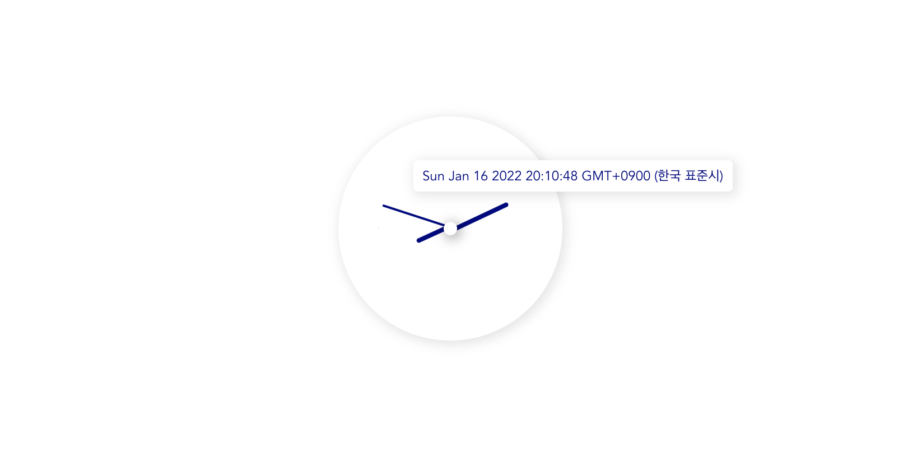

# YujinChoi

## 1. Overview

This project is written in Vue3 + TypeScript. To see the preview-deployed, click [here](https://yujinchoi-bs6s02068-estellechoi.vercel.app/).



## 2. Run

### Install yarn

```zsh
# yarn not installed yet, install it
npm install yarn -g
```

### Install packages

```zsh
yarn install
```

### Compile and hot-reload in development mode

```zsh
yarn serve
```

### Compile and minify for production (if you want)

```zsh
yarn build
```

### Install `serve` globally to serve built output

```zsh
yarn global add serve
```

### Serve production output

```zsh
serve dist
```
